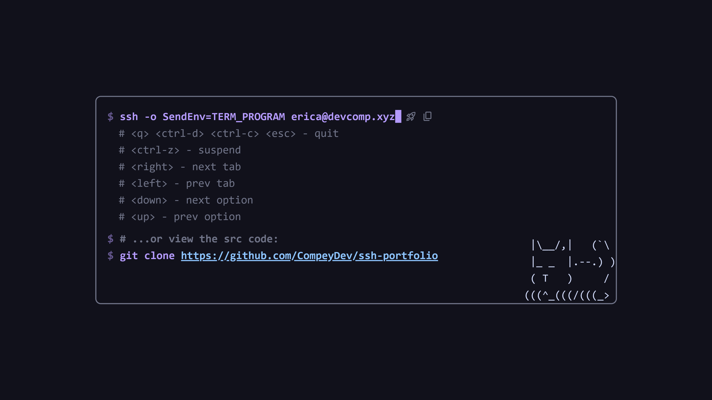

# ssh-portfolio


what if the internet as we knew it was *different*? what if the world wide web
never came to be? what if... we lived in our own little ssh services?
introducing a portfolio as a tui app served over ssh!

try it out:

```sh
ssh -o SendEnv=TERM_PROGRAM erica@devcomp.xyz
```

> [!TIP]
> make sure you have a [nerd font](https://www.nerdfonts.com/) installed or some features may not work!

## features

- about & projects tab 
- wip blog powered by atproto ([whitewind](https://github.com/whtwnd/whitewind-blog))
- http landing page

## showcase

| desc        | img                                                                                                                                                                          |
| ----------- | ---------------------------------------------------------------------------------------------------------------------------------------------------------------------------- |
| about       |                                                                         |
| projects    |                                                  |
| web landing |  |

## running

### with cargo

you'll need to have rust installed, you can do that using [rustup](https://rustup.rs/). then, run using:

```sh
cargo run --release --no-default-features -- --help
```

### with nix

the nix flake exports a package with an overridable `features` attribute. `default.nix` exports two variants using this, 
`ssh-portfolio` and `ssh-portfolio-blog`.

```sh
nix build --file . ssh-portflio      # without blog
nix build --file . ssh-portflio-blog # with blog

# then run it:
./result/bin/ssh-portfolio --help
```

or with your own set of features to build for:

```nix
# assuming this is in `custom.nix` in the same directory as `flake.nix`:
{ pkgs ? import <nixpkgs> { } }:
{
  ssh-portfolio-custom = (builtins.getFlake (builtins.toString ./.)).packages.${pkgs.system}.ssh-portfolio.override { features = [ ... ]; };
}
```

### with docker

build an image:

```sh
docker build -t ssh-portfolio:latest --build-arg CARGO_FEATURES= .
```

to run it:

```sh
docker run ssh-portfolio:latest -- --help
```

## configuration

configuration options can be specified within a configuration file. this file is
located within your configuration directory.

- Linux: `$XDG_CONFIG_HOME/ssh-portfolio` or `~/.config/ssh-portfolio`
- macOS: `~/Library/Application Support/xyz.devcomp.ssh-portfolio`
- Windows: `%LOCALAPPDATA%\devcomp\ssh-portfolio\config`

the directory can be overridden using the `SSH_PORTFOLIO_CONFIG` environment
variable. the name of the config file can be: `config.json5`, `config.json`,
`config.yaml`, `config.toml`, and `config.ini`.

the default config is as follows:

```json
{
  "private_keys": {
    "ssh-rsa": "$DATA_DIR/ssh/id_rsa",
    "ecdsa-sha2-nistp256": "$DATA_DIR/ssh/id_ecdsa",
    "ssh-ed25519": "$DATA_DIR/ssh/id_ed25519"
  },
  "keybindings": {
    "Home": {
      "<q>": "Quit",
      "<Ctrl-d>": "Quit",
      "<Ctrl-c>": "Quit",
      "<Esc>": "Quit",
      "<Ctrl-z>": "Suspend",
      "<right>": "NextTab",
      "<left>": "PrevTab",
      "<down>": "SelectNext",
      "<up>": "SelectPrev",
      "<enter>": "Continue"
    }
  }
}
```

### private_keys

specifies the path to the files containing the SSH private keys to use. the
following variables are expanded:

- `$DATA_DIR`: the data directory, this can be overridden with the
  `SSH_PORTFOLIO_DATA` environment variable. defaults to:
  - Linux: `$XDG_DATA_HOME/ssh-portfolio` or `~/.local/share/ssh-portfolio`
  - macOS: `~/Library/Application Support/xyz.devcomp.ssh-portfolio`
  - Windows: `%LOCALAPPDATA%\devcomp\ssh-portfolio\data`
- `$CONFIG_DIR`: the configuration directory, as described above.
- `$HOME`: the home directory, aka `~`.

### keybindings

specifies the keybinds! this is an object where the key corresponds to a mode
and the value is an object mapping a key to an action. currently, the only mode
available is `Home`.

these actions can be specified:

- General
  - `Tick`: do a tick
  - `Render`: renders the tui
  - `Suspend`: suspends
  - `Resume`: resumes after a suspend
  - `Quit`: quits
  - `ClearScreen`: clears the screen
- Tabs
  - `NextTab`: go to the next tab
  - `PrevTab`: go to the previous tab
- Selection
  - `SelectNext`: select the next item
  - `SelectPrev`: select the previous item
  - `Continue`: activate the currently selected item
